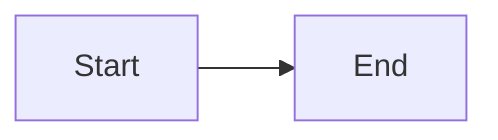

# <PROJECT_NAME>

<!-- One sentence: what it is and for whom. -->

## 1. Project Overview

<!-- 3-5 sentences:
     - What does this project do?
     - What problem does it solve?
     - Who are the users (humans, services, both)?
     Keep it factual. No marketing copy. -->

## 2. Architecture

<!-- A diagram (mermaid or ASCII) plus 5-10 sentences explaining the
     main flow of data and control. Mention the major boundaries
     (modules, services, processes) and how they communicate.
     Replace the mermaid block below with your own diagram, or remove
     the fenced block entirely if you prefer prose. -->

## 3. Key Directories

<!-- Only the directories that matter. Don't dump the full tree.
     Format: a short table. -->

| Path | Purpose |
|---|---|
| `<YOUR_DIR_PATH>` | <YOUR_DIR_PURPOSE> |
| `<YOUR_DIR_PATH>` | <YOUR_DIR_PURPOSE> |

## 4. Conventions

<!-- Style, naming, testing approach. Link to .editorconfig, eslint
     config, ruff config, etc. instead of duplicating their content. -->

- **Code style:** <YOUR_CODE_STYLE>.  <!-- e.g. "Black + Ruff" or "Prettier + ESLint" -->
- **Naming:** <YOUR_NAMING_CONVENTION>.  <!-- e.g. "snake_case for files, PascalCase for classes" -->
- **Tests:** <YOUR_TEST_APPROACH>.  <!-- e.g. "pytest, one test file per source file, AAA layout" -->

## 5. Commands

<!-- Only the commands a developer runs daily. -->

| Command | Purpose |
|---|---|
| `<YOUR_BUILD_CMD>` | Build the project. |
| `<YOUR_TEST_CMD>` | Run the test suite. |
| `<YOUR_LINT_CMD>` | Run the linter. |
| `<YOUR_RUN_CMD>` | Run the application locally. |

## 6. Common Workflows

<!-- "How do I X" recipes. Two or three is enough; more goes in
     .claude/memory/playbooks/ (see the memory/ scaffold next to this file). -->

### How to add a feature

<!-- Replace with the actual workflow for this repo. -->

### How to fix a typical bug

<!-- Replace with the actual workflow for this repo. -->

## 7. Anti-Patterns

<!-- What NOT to do in this repo + why. The why is the important part —
     a rule without a reason invites being ignored.
     Example: "Don't commit secrets to the repo — because they persist
     in history even after deletion." -->

- **Don't <YOUR_ANTIPATTERN>** — because <YOUR_REASON>.
- **Don't <YOUR_ANTIPATTERN>** — because <YOUR_REASON>.

## 8. Tool Protocol  <!-- mcp:code-context | OPTIONAL -->

<!-- Only if you have the `code-context` MCP installed.
     If not, delete this entire section. -->

You have three tools from the `code-context` MCP server. Use them proactively:

- **`search_repo(query, top_k?, scope?)`** — call this BEFORE editing or reading
  large amounts of code. The query should describe the task in natural language.
  Example: search_repo("where do we validate user emails on signup")

- **`recent_changes(since?, paths?, max?)`** — call when the user mentions "recent",
  "the new", "what changed", or before suggesting changes that might conflict
  with in-flight work.

- **`get_summary(scope?, path?)`** — call ONCE at the start of an unfamiliar
  task to orient yourself. Don't call repeatedly.

Prefer these tools over Glob/Grep when the question is semantic
("how do we do X") rather than literal ("where is the string Y").

## 9. References & Memory

<!-- External links (docs, dashboards, trackers) + pointer to dynamic memory. -->

### External resources

- **Docs:** <YOUR_DOCS_LINK>
- **Dashboards:** <YOUR_DASHBOARDS_LINK>
- **Issue tracker:** <YOUR_TRACKER_LINK>

### Dynamic memory

Per-repo memory lives in `.claude/memory/`. Start with `.claude/memory/MEMORY.md` —
it's the index. The four categories are: `decisions/`, `gotchas/`, `glossary/`,
`playbooks/`.

